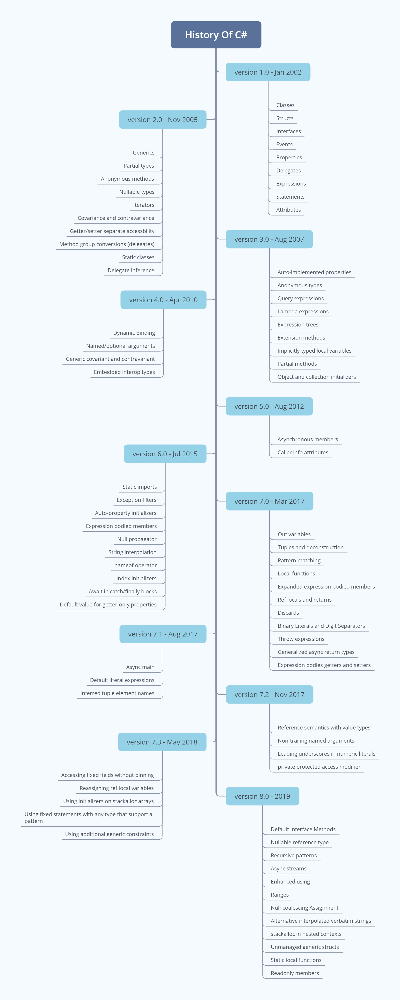

# C# Version History
The Version History Of The C-Sharp Programming Language.

This repository was primarily intended to be used along with the article [C# Version History](https://www.debuggershub.com/c-sharp-version-history) for [DebuggersHub](http://debuggershub.com/).

The chart is made using the features provided in the [microsoft`s charp-version-history documentation](https://docs.microsoft.com/en-us/dotnet/csharp/whats-new/csharp-version-history) and a mind mapping tool called [Xmind](https://www.xmind.net/) .

### About

Below is a chart that displaying the features that are included in each major release of the C# Programming Language. It will be maintained and updated on a timely basis as new features arrive in the C# Language. 

## Motivate ⭐️

If you find this project useful, don`t forget to give it a star. Thanks!

### References

- [Microsoft C# Version History](https://docs.microsoft.com/en-us/dotnet/csharp/whats-new/csharp-version-history)
- [Wikipedia – C Sharp Programming Language](https://en.wikipedia.org/wiki/C_Sharp_(programming_language))
- [dotnet/roslyn project](https://github.com/dotnet/roslyn/blob/master/docs/Language%20Feature%20Status.md)
